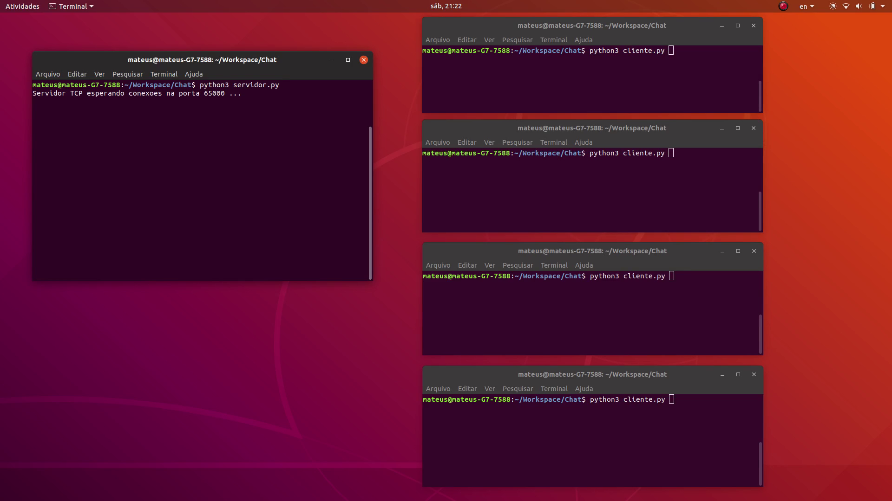

# Chat
Chat utilizando Sockets e Threads

<figure class="video_container">
  <video controls="true" allowfullscreen="true" poster="midia/poster_image.png">
    <source src="midia/video.mp4" type="video/mp4">
  </video>
</figure>
